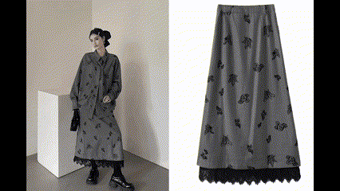

# FluxVton-Wild-Datasets
Wild-Datasets Share

    

## 1. 衣服图片

以下是数据集中包含的部分衣服图片展示：

    
    
        
    
        
    
        
    
        
    
        
    

## 2. 模特图片

以下是数据集中包含的部分模特图片展示：

    
    
    

