# FluxVton-Wild-Datasets
Wild-Datasets Share

The dataset include 3000 pairs of wild-samples.

## 1. Model images

Here are some model images included in the dataset

    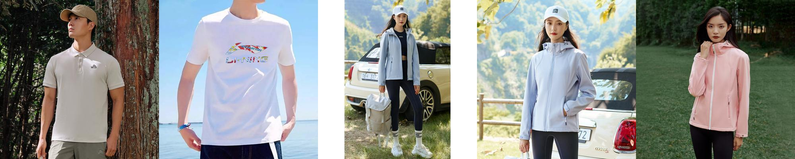
    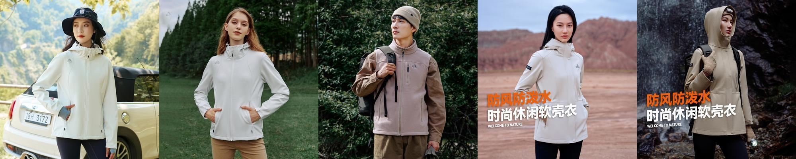
        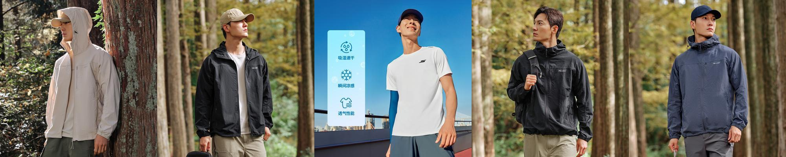
    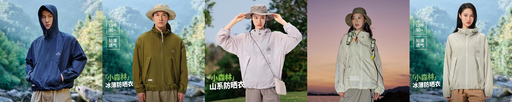
        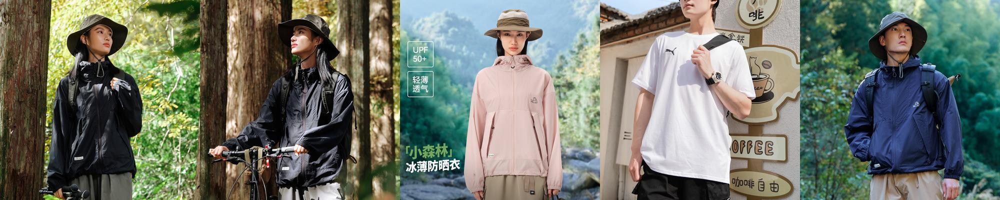
    
        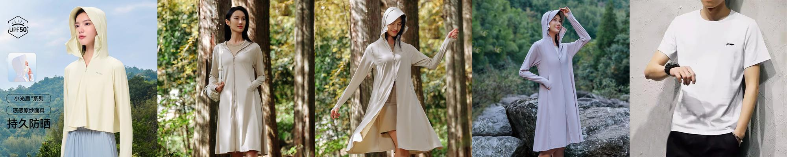
    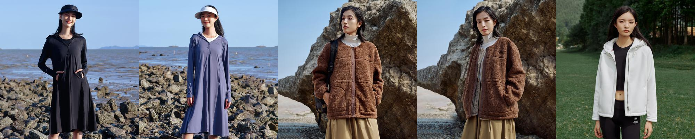
        
    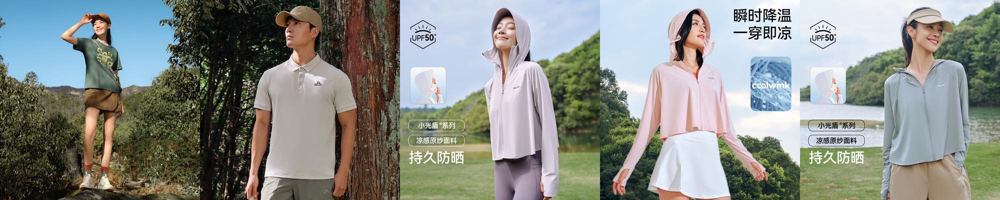
        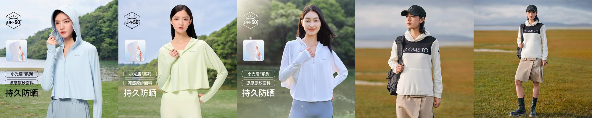
    

## 2. Clothing images

Here are some clothing images included in the dataset:

    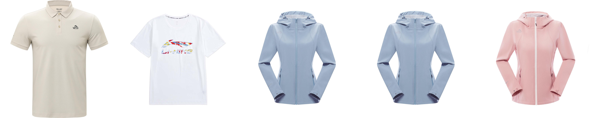
    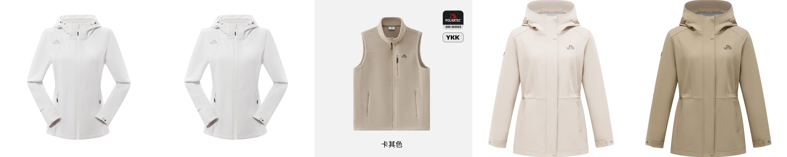
        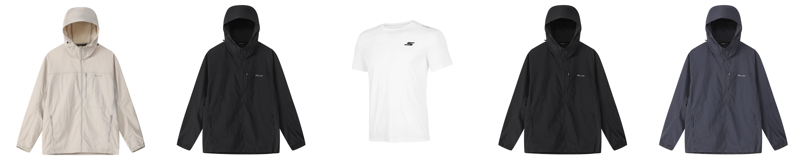
    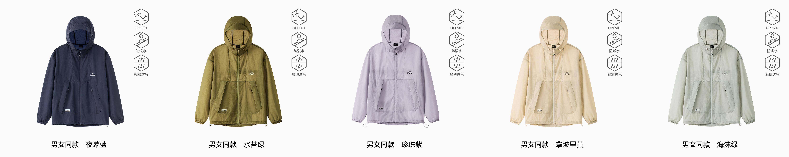
        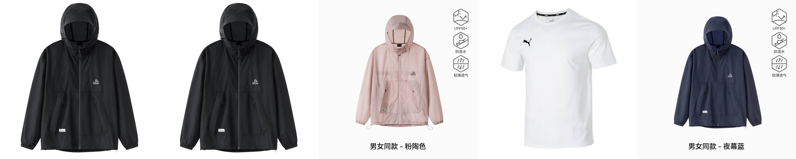
    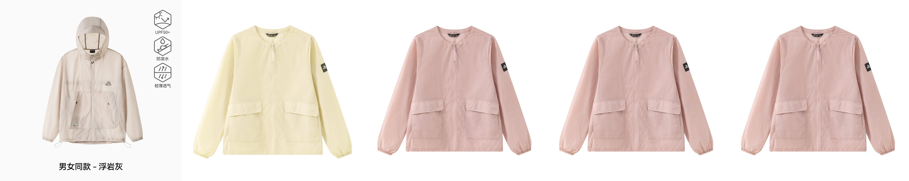
        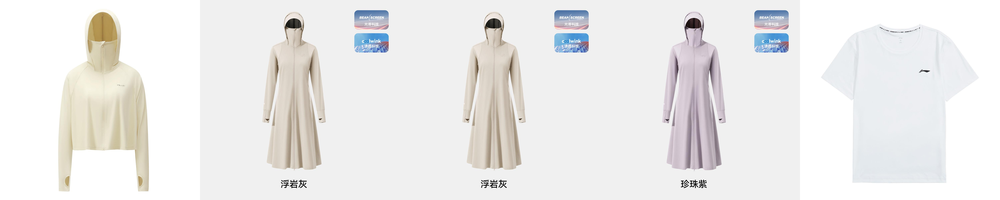
    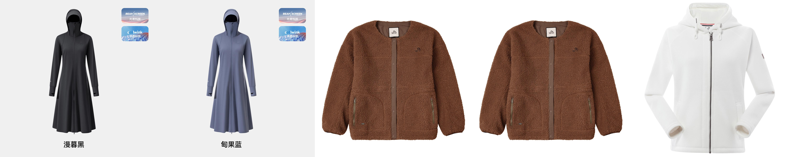
        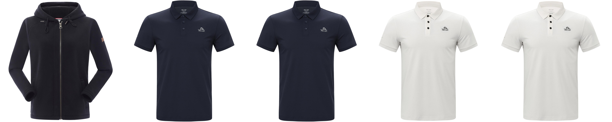
    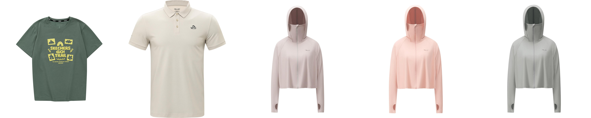
        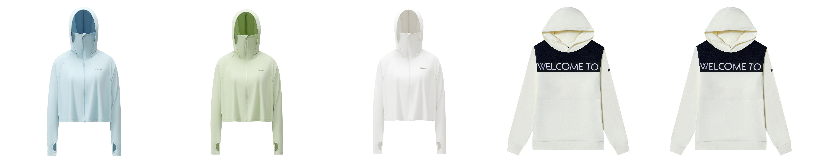
    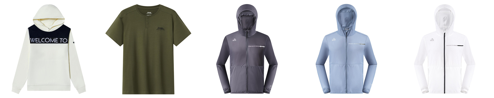

The dataset provided is intended for research purposes only. Access to this dataset is granted on the condition that the applicant's research aligns with the intended objectives and goals of the data collection. To apply for access to the dataset, interested researchers must submit a formal request that includes a detailed description of their research proposal and a declaration confirming that the use of the data will be strictly for the stated research purposes.

Applicants must also provide proof of their institutional affiliation or relevant qualifications that justify their need for access to the dataset. This may include, but is not limited to, a letter of support from their research institution or a description of how the data will be used to contribute to the field of study.

Please direct all inquiries and data access requests to jinwei@zcmu.edu.cn.

